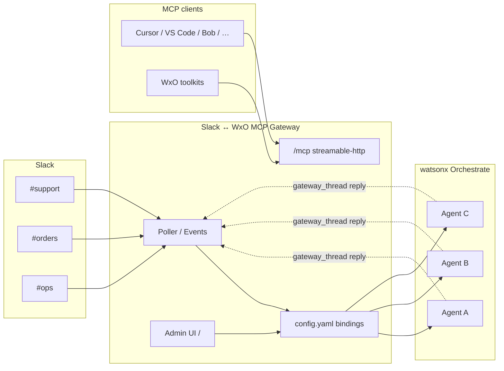
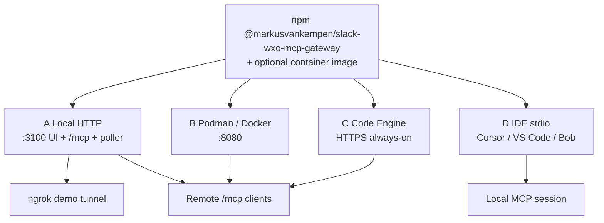
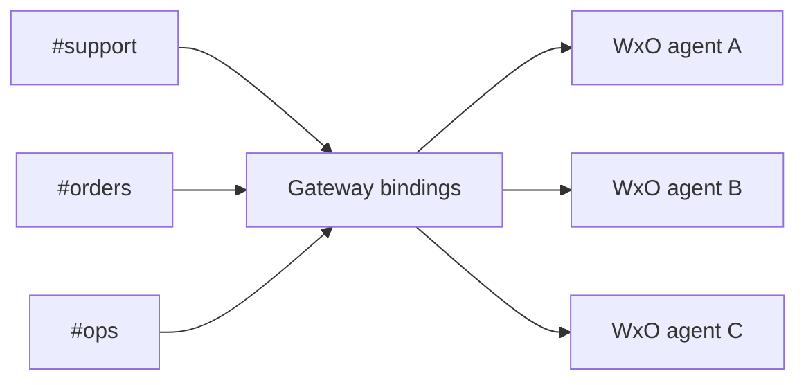
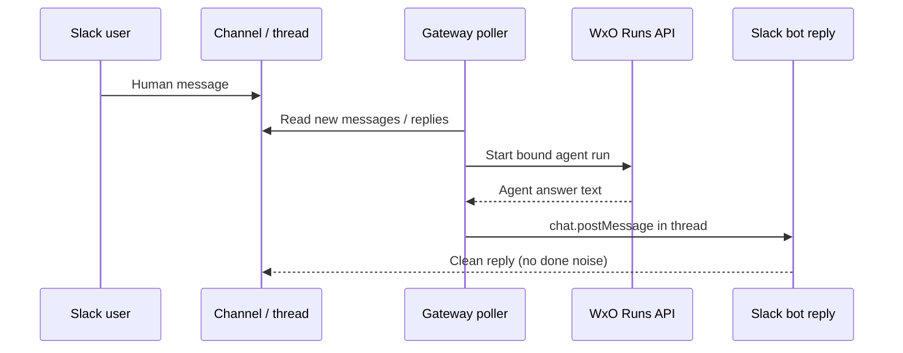

# Slack ↔ WxO MCP Gateway

**Author:** Markus van Kempen  
**Email:** [mvankempen@ca.ibm.com](mailto:mvankempen@ca.ibm.com) · [markus.van.kempen@gmail.com](mailto:markus.van.kempen@gmail.com)  
**Web:** [https://markusvankempen.github.io/](https://markusvankempen.github.io/) · [GitHub](https://github.com/markusvankempen)

**npm:** [`@markusvankempen/slack-wxo-mcp-gateway`](https://www.npmjs.com/package/@markusvankempen/slack-wxo-mcp-gateway) · **MCP:** `io.github.markusvankempen/slack-wxo-mcp-gateway`

> **This GitHub repo is documentation + registry metadata.** It does **not** include the runnable application source.  
> **Install / run via npm:** `npx -y @markusvankempen/slack-wxo-mcp-gateway` · Site: [https://markusvankempen.github.io/](https://markusvankempen.github.io/)

**Pitch:** MCP gateway that **lifts watsonx Orchestrate Slack limitations** — every-message wake-up, multi-channel→multi-agent routing, clean in-thread replies, and a streamable-http toolkit for WxO + Cursor / VS Code / Bob / Antigravity — without replacing your agents.

`tags:` `wxo-limitations` · `byo-slack` · `every-message` · `multi-channel` · `multi-agent` · `thread-followups` · `gateway-thread` · `no-done-noise` · `mcp-toolkit` · `streamable-http` · `poller` · `code-engine` · `ngrok` · `agentic-ai`

> **One config site:** map many Slack channels → many WxO agents.  
> Poller (and optional Slack Events) wake agents.  
> Same host exposes an **MCP toolkit** (`/mcp`) for WxO / Cursor / other clients.

Deep dive: **[Why this MCP — lifting WxO limits](docs/WHY-THIS-MCP.md)**

### Architecture at a glance



---

## Why this approach (WxO limits → lift)

| WxO / Slack limit | Tag | Gateway lift |
|-------------------|-----|----------------|
| `byo_slack` ≈ @mention / DM only | `every-message` | Poller / Events wake agents on **every** human message |
| Hard to run many channels → many agents | `multi-channel` `multi-agent` | One bindings table + admin UI |
| Thread follow-ups easy to drop | `thread-followups` | Reads thread replies + context |
| Noisy finals (`done`, etc.) in Slack | `gateway-thread` `no-done-noise` | Gateway posts answers; filters noise |
| Agents need remote tools with real DNS | `mcp-toolkit` `streamable-http` | Hosted `/mcp` for Orchestrate toolkits |
| Ops stuck cloning pollers | `ops-self-serve` | MCP tools + diagnostics + logs |
| Slack ops only inside Slack/WxO UI | `ide-parity` | Same tools in Cursor, VS Code, Bob, Antigravity, Claude |

WxO stays the **brain** (LLMs, skills, flows). This gateway is the **Slack + routing + MCP edge**.  
Bring-your-own agent frameworks: [`docs/frameworks/`](docs/frameworks/) (LangGraph, LlamaIndex, OpenAI Agents).

---

## npm / MCP identity

| | |
|---|---|
| npm | `@markusvankempen/slack-wxo-mcp-gateway` |
| MCP name | `io.github.markusvankempen/slack-wxo-mcp-gateway` |
| Topics | `mcp` · `mcp-server` · `slack` · `watsonx` · `watsonx-orchestrate` · `ibm` · `wxo` · `byo-slack` · `multi-channel` · `code-engine` · `streamable-http` · `cursor` · `agentic-ai` |

Full keyword list lives in [`package.json`](package.json) for npm discoverability.

---

## Publish & run modes (A–D)

**One package / one image** — pick a mode (see [`docs/PUBLISH-MODES.md`](docs/PUBLISH-MODES.md)):



| Mode | Command | Use |
|------|---------|-----|
| **A** Local HTTP | `./scripts/run.sh --mode http` | UI + `/mcp` + poller on laptop |
| **B** Podman/Docker | `./scripts/run.sh --mode podman` | Same app in a container |
| **C** Code Engine | `./scripts/run.sh --mode ce` | Always-on HTTPS |
| **D** IDE MCP | `./scripts/run.sh --mode ide` | Cursor / VS Code stdio snippets (+ `--exec`) |
| Ngrok demo | `./scripts/run.sh --mode ngrok` | A + tunnel + WxO toolkit |

```bash
./scripts/run.sh --mode ide      # print Cursor + VS Code mcp.json
./scripts/run.sh --mode http     # local host :3100
./scripts/run.sh --mode podman   # container :8080
./scripts/run.sh --mode ce       # IBM Code Engine
```

Deep guides: [`docs/local-ngrok/`](docs/local-ngrok/) · [`docs/code-engine/`](docs/code-engine/) · [`docs/ide/`](docs/ide/)  
Index: [`docs/README.md`](docs/README.md) · Setup: [`SETUP.md`](SETUP.md)

Copy-paste IDE JSON: [`examples/mcp/`](examples/mcp/)

## Agent frameworks (LangGraph · LlamaIndex · OpenAI Agents)

Connect frameworks **to** this MCP — do not embed them in the gateway.

| Guide | Focus |
|-------|--------|
| [`docs/frameworks/`](docs/frameworks/) | Index + checklist |
| [`docs/frameworks/langgraph.md`](docs/frameworks/langgraph.md) | LangGraph / LangChain |
| [`docs/frameworks/llamaindex.md`](docs/frameworks/llamaindex.md) | LlamaIndex |
| [`docs/frameworks/openai-agents.md`](docs/frameworks/openai-agents.md) | OpenAI Agents SDK |

### Install (npm / npx) — not from this repo

```bash
# Hosted HTTP + admin UI (default)
npx -y @markusvankempen/slack-wxo-mcp-gateway

# IDE / stdio MCP
npx -y @markusvankempen/slack-wxo-mcp-gateway --stdio
```

Requires Node 18+ and Python 3.10+. Env template: [`.env.example`](.env.example). Guides: [local-ngrok](docs/local-ngrok/) · [code-engine](docs/code-engine/).

---

## Mental model

Multi-channel routing:



Message path (`reply_mode: gateway_thread`):



Same host also serves **MCP** at `/mcp` and the **admin UI** at `/`.

---

## Config (`config.yaml`)

| Field | Meaning |
|-------|---------|
| `slack_channel_id` | e.g. `C0BHWEZ7NLC` |
| `wxo.agent_id` | Target Orchestrate agent |
| `mode` | `poll` \| `events` \| `both` |
| `reply_mode` | `gateway_thread` = gateway posts Slack thread after Runs API; `agent_tools` = only start agent |
| `poll_sec` / `lookback_sec` | Poller timing |

Secrets: use `${ENV_VAR}` (loaded from `.env`).

---

## Endpoints

| Path | Role |
|------|------|
| `/` | Admin UI |
| `/mcp` | MCP streamable HTTP |
| `/slack/events` | Slack Event Subscriptions |
| `/health` | Liveness |
| `/api/logs` | Log ring buffer |
| `/api/tools` | MCP tool catalog |
| `/api/diagnostics` | Slack + WxO checks |
| `/api/poll` | One poll cycle |
| `/api/config` | Masked JSON / raw YAML |

### Admin dashboard auth

```bash
GATEWAY_ADMIN_USER=admin
GATEWAY_ADMIN_PASSWORD=choose-a-strong-password
```

Protects `/` and `/api/*`. **Public:** `/health`, `/mcp`, `/slack/events`.

### IBM Code Engine

```bash
./deploy_code_engine.sh
./test_code_engine.sh
```

Register the toolkit:

```bash
orchestrate toolkits add -k mcp -n slack_wxo_gateway \
  --url "https://YOUR-HOST/mcp" \
  --transport streamable_http \
  --tools "*"
```

### MCP tools (14)

**Config:** `list_bindings`, `upsert_binding`  
**Slack:** `list_slack_channels`, `list_recent_messages`, `list_thread_replies`, `get_message_context`, `post_thread_reply`, `set_typing_indicator`  
**WxO:** `list_wxo_agents`, `invoke_wxo_agent`  
**Ops:** `poll_once`, `get_gateway_status`, `get_recent_logs`, `run_diagnostics_tool`

Bot scopes: `channels:read`, `groups:read`, `reactions:write` (reinstall Slack app after adding).

**Agents:**

| Agent | Role |
|-------|------|
| [`agent.yaml`](agent.yaml) → `slack_gateway_test_agent` | Full-toolkit smoke |
| [`agents/slack_gateway_ops_agent.yaml`](agents/slack_gateway_ops_agent.yaml) | Day-2 ops / routing |
| [`agents/slack_gateway_answer_agent.yaml`](agents/slack_gateway_answer_agent.yaml) | Channel answers (`gateway_thread`) |

**Setup (Slack + WxO):** [`SETUP.md`](SETUP.md) — also live in admin UI → **Setup**  
**Use cases + test plan:** [`USE_CASES.md`](USE_CASES.md)  
**Publish (npm / GitHub):** [`PUBLISH.md`](PUBLISH.md)

---

## Reply modes

**`gateway_thread` (default)** — poller/Events → Runs API → gateway `chat.postMessage` in thread. Use the answer-only agent (no `done`).

**`agent_tools`** — gateway only starts the agent; agent uses its own Slack tools.

---

## Cursor / VS Code / Bob / Antigravity / Claude

See **[`docs/ide/`](docs/ide/)** for each client. Quick remote bridge:

```json
{
  "mcpServers": {
    "slack-wxo-gateway": {
      "command": "npx",
      "args": ["-y", "mcp-remote", "https://YOUR-HOST/mcp"]
    }
  }
}
```

Package identity:

- npm: [`@markusvankempen/slack-wxo-mcp-gateway`](https://www.npmjs.com/package/@markusvankempen/slack-wxo-mcp-gateway)
- MCP: `io.github.markusvankempen/slack-wxo-mcp-gateway`
- Site: [https://markusvankempen.github.io/](https://markusvankempen.github.io/)

---

## License

[Apache-2.0](LICENSE) — © Markus van Kempen  
[https://markusvankempen.github.io/](https://markusvankempen.github.io/) · [https://github.com/markusvankempen](https://github.com/markusvankempen)
