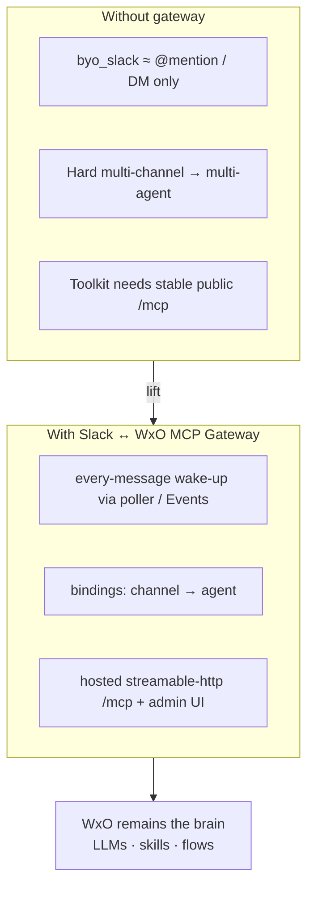
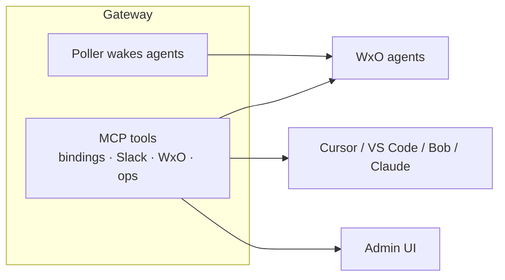

# Why this MCP gateway — lifting WxO Slack limitations

**Author:** Markus van Kempen  
**Email:** [mvankempen@ca.ibm.com](mailto:mvankempen@ca.ibm.com) · [markus.van.kempen@gmail.com](mailto:markus.van.kempen@gmail.com)  
**Web:** [https://markusvankempen.github.io/](https://markusvankempen.github.io/) · [GitHub](https://github.com/markusvankempen)

`tags:` `wxo-limitations` · `byo-slack` · `every-message` · `multi-channel` · `multi-agent` · `thread-followups` · `mcp-toolkit` · `streamable-http` · `gateway-thread` · `no-done-noise` · `poller` · `slack-events` · `code-engine` · `ngrok` · `cursor` · `vscode` · `ibm-bob` · `antigravity` · `agentic-ai`

watsonx Orchestrate is excellent at **agents + tools**. Out of the box Slack (`byo_slack`) is intentionally narrow. This gateway is the **custom integration layer** that keeps WxO as the brain while removing several Slack / routing / tooling ceilings.

---

## The limitation → lift map

| Tag | WxO / Slack limitation (today) | What this MCP gateway does |
|-----|--------------------------------|----------------------------|
| `byo-slack` · `every-message` | `byo_slack` wakes agents mainly on **@mention / DM**, not every channel message | **Poller** (and optional **Events**) wakes the bound agent on each human message |
| `multi-channel` · `multi-agent` | One Slack integration ≠ easy “channel A → agent A, channel B → agent B” ops model | **Bindings** in one `config.yaml` / admin UI — many channels → many agents |
| `thread-followups` | In-thread follow-ups are easy to miss if you only watch top-level messages | Poller uses **thread replies** + context so “what is 2+2?” in a thread still works |
| `gateway-thread` · `no-done-noise` | Agent finals / byo_slack can post noise (`done`, typing fluff) into Slack | `reply_mode: gateway_thread` + answer-only agent — **gateway posts** the answer; filters noise finals |
| `mcp-toolkit` · `streamable-http` | WxO agents need a **remote MCP** URL they can trust (real DNS, stable transport) | Hosted `/mcp` with **streamable HTTP** + `stateless_http` (avoids sticky-session “Session terminated”) |
| `ops-self-serve` | Changing routing often means cloning pollers or hand-editing many places | **Admin UI** + MCP tools (`list_bindings`, `upsert_binding`, diagnostics, logs) |
| `ide-parity` | Slack ops stuck in Slack or WxO UI only | Same toolkit in **Cursor / VS Code / Bob / Antigravity / Claude** (stdio or remote `/mcp`) |
| `hosting` · `code-engine` · `ngrok` | Localhost is invisible to WxO SSRF / Slack Events | **ngrok** for demos; **Code Engine** for always-on stable URLs |

---

## Why MCP (not only a private poller)?

`tags:` `mcp` · `tool-calling` · `wxo-toolkit` · `reuse`

1. **WxO agents call the same tools** you use in the admin UI — list channels, post threads, poll once, diagnose.  
2. **IDEs share the toolkit** — ops agents and developers use one contract.  
3. **Remote toolkit registration** is the WxO-native way to extend agents without baking Slack SDKs into every skill.  
4. **Streamable HTTP** matches how Orchestrate imports remote MCP toolkits today.

A bare channel poller can wake agents; an **MCP gateway** also makes Slack + routing **tools** for agents and IDEs.

---

## What we deliberately do *not* replace

| Keep in WxO | Still use this gateway for |
|-------------|----------------------------|
| Agent LLMs, RAG, skills, flows | Channel wake-up without @mention |
| `byo_slack` for @mention bots you already like | Multi-channel routing table |
| Orchestrate auth / environments | Hosted `/mcp` toolkit + admin ops |

Coexistence: @mention → `byo_slack`; every-message channels → gateway bindings. Loop guards skip bots / already-answered top-level threads.

---

## One-line pitch (for GitHub / npm)

> **MCP gateway that lifts WxO Slack limits:** every-message wake-up, multi-channel→multi-agent routing, clean in-thread replies, and a streamable-http toolkit for Orchestrate + Cursor/VS Code/Bob/Antigravity — without replacing your agents.

---

## Related docs

| Doc | Focus |
|-----|--------|
| [../SETUP.md](../SETUP.md) | Slack scopes, env, agents |
| [local-ngrok/](local-ngrok/) · [code-engine/](code-engine/) | Deploy paths |
| [ide/](ide/) | IDE MCP configs |
| [frameworks/](frameworks/) | LangGraph, LlamaIndex, OpenAI Agents |
| [../USE_CASES.md](../USE_CASES.md) | Real-world scenarios |
